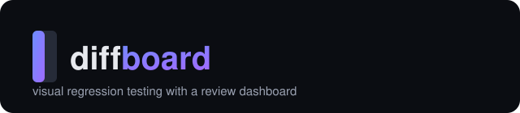
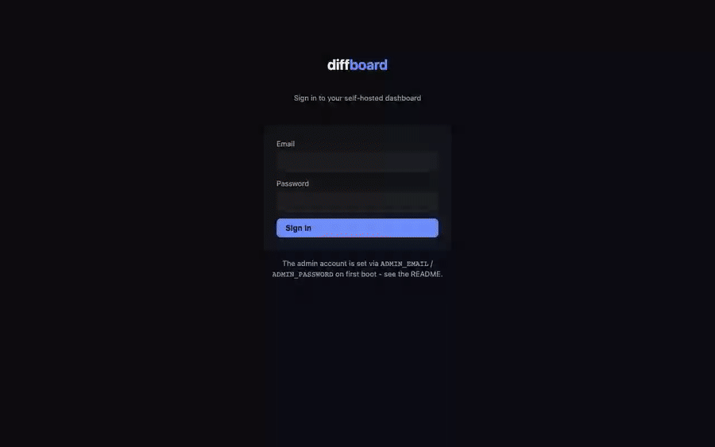

<div align="center">



**diffboard** — catch the pixel that broke, review it like a PR. A self-hosted visual
regression testing tool: a Playwright-powered CLI that screenshots your app in CI and diffs
it against an approved baseline, plus a review dashboard where a human approves or rejects
each change before the build goes green.

[](https://github.com/Laaaaksh/diffboard/stargazers)
[](https://playwright.dev)

[](https://github.com/Laaaaksh/diffboard/actions/workflows/ci.yml)
[](LICENSE)
[](packages)
[](#install)

**[Install](#install) • [Usage](#usage) • [Configuration](#configuration) • [Changelog](CHANGELOG.md) • [Contributing](CONTRIBUTING.md) • [License](LICENSE)**

**[Code of conduct](CODE_OF_CONDUCT.md) • [Security](SECURITY.md)**

</div>

## Demo



A real run against the demo fixture in this repo: sign in, capture a baseline, ship a real CSS
change to the CTA button, then triage the flagged diff in the review dashboard - approving the
desktop screenshot (the intended rebrand) and rejecting the mobile one, where the same change
shrinks the button below a usable tap target. Full quality: [docs/assets/demo.mp4](docs/assets/demo.mp4).

## What it does

- Captures screenshots of any URL or Storybook story across a viewport matrix, driven by a
  real headless Chromium via Playwright
- Diffs every screenshot against the branch's last-approved baseline with a perceptual
  pixel-diff engine that ignores font-antialiasing noise, not a naive pixel-exact compare
- Freezes CSS animations/transitions and lets you mask known-dynamic selectors before
  capture, so spinners, blinking cursors, and timestamps don't produce false-positive diffs
- Posts a commit status and a PR comment straight from CI - no GitHub App to install, it
  reuses the `GITHUB_TOKEN` your workflow already has
- Ships a review dashboard with a slider / side-by-side / diff-overlay comparison view, where
  approving a screenshot updates the baseline and turns the check green
- Runs entirely on infrastructure you already have: `docker compose up` gets you Postgres +
  the dashboard, with no per-snapshot billing and no third party watching your screenshots

## Why not Percy or Chromatic?

Percy and Chromatic are good products, billed per screenshot. Chromatic's free tier caps out
at 5,000 snapshots/month, and its paid tiers start at $179/mo; a real component library on
every PR burns through that fast. diffboard has no snapshot meter because there's no vendor
counting them - you run the CLI and the dashboard on your own infrastructure.

The closest open-source options today are either archived (Lost Pixel), stale for two years
(BackstopJS), or a static HTML report with no review dashboard (reg-suit). diffboard is a new
project that ships the piece those tools don't have: a slider / side-by-side / diff-overlay
dashboard with an explicit approve-or-reject step, not just a diff report to read yourself.

## Requirements

- **CLI**: Node.js 20+ (bundles its own Chromium via Playwright)
- **Dashboard**: Docker, if you use the bundled `docker-compose.yml` (recommended) - or
  Node.js 20+ and a Postgres 14+ database if you run it yourself

## Install

**1. Run the dashboard.** From a clone of this repo:

```bash
git clone https://github.com/Laaaaksh/diffboard.git
cd diffboard
cp .env.example .env
# edit .env: SESSION_SECRET (openssl rand -hex 32), ADMIN_EMAIL, ADMIN_PASSWORD
docker compose up -d
```

Open `http://localhost:4300`, sign in with the admin account from `.env`, and create a
project - the dashboard shows you a CLI token, once.

**2. Install the CLI** wherever your CI runs (or locally):

```bash
npm install -g diffboard
```

> No tagged release has been published to npm yet, so the command above has nothing to
> install. Until a `v0.1.0` release goes out, build the CLI from source instead:
>
> ```bash
> git clone https://github.com/Laaaaksh/diffboard.git
> cd diffboard && corepack enable && pnpm install
> pnpm --filter @diffboard/core run build
> pnpm --filter diffboard run build
> cd packages/cli && npm link   # puts `diffboard` on your PATH
> ```

## Usage

```bash
diffboard init   # writes a starter diffboard.config.js
```

```js
// diffboard.config.js
export default {
  serverUrl: process.env.DIFFBOARD_SERVER_URL,
  baseBranch: "main",
  viewports: [
    { name: "desktop", width: 1280, height: 800 },
    { name: "mobile", width: 390, height: 844 },
  ],
  targets: [{ name: "home", url: "http://localhost:3000/" }],
};
```

```bash
DIFFBOARD_TOKEN=<project token> diffboard test
```

```
diffboard: capturing 1 target(s) × 2 viewport(s)
diffboard: created build cm... (feature-x → main)
  ≠ home @ desktop: CHANGED
  ＝ home @ mobile: UNCHANGED
diffboard: 0 new, 1 changed, 1 unchanged
diffboard: http://localhost:4300/builds/cm...
```

`diffboard test` exits `1` when any screenshot is new or changed (so it fails your CI check
until a human reviews it) and `0` when everything matches the baseline. See
[`examples/github-actions/diffboard.yml`](examples/github-actions/diffboard.yml) for a
drop-in GitHub Actions workflow, and
[`examples/demo-site`](examples/demo-site) for the fixture the demo above was captured from.

## Configuration

| Field | Default | |
|---|---|---|
| `serverUrl` | — | Your dashboard's URL |
| `token` | `DIFFBOARD_TOKEN` env var | Project token from the dashboard |
| `baseBranch` | `"main"` | The branch every other branch is diffed against |
| `threshold` | `0.1` | % of changed pixels above which a screenshot is flagged `CHANGED` |
| `targets` | — | `{ name, url, mask?, waitFor?, fullPage? }[]` - pages/stories to capture |
| `viewports` | — | `{ name, width, height }[]` |

`target.mask` takes CSS selectors to paint over before capture (timestamps, ads, anything
legitimately different every run). Full field docs are in
[`packages/core/src/types.ts`](packages/core/src/types.ts).

### GitHub integration

The CLI posts the initial commit status and PR comment using the `GITHUB_TOKEN` Actions
already gives your workflow - nothing to install or authorize. Approving or rejecting a
screenshot from the dashboard happens outside that CI run, though, so flipping the check
back to green from there needs its own credential: set a GitHub PAT with `repo:status` scope
on the project in the dashboard (New Project screen, or later in project settings). Skip that
and the dashboard still works - the commit status just won't update again after you review.

## Limits

- **Chromium only.** Capture always runs through Playwright's Chromium, with no Firefox or
  WebKit option. If a real rendering difference in Safari or Firefox is what you need to
  catch, this won't catch it - Percy and Chromatic both offer cross-browser capture.
- **Storage**: screenshots live on local disk under the `diffboard-storage` Docker volume by
  default. There's no automatic pruning yet - if you're capturing a lot of history, keep an
  eye on disk usage.
- **Auth**: one shared admin account (`ADMIN_EMAIL`/`ADMIN_PASSWORD`), no SSO. Fine for a
  small team behind a VPN or basic-auth proxy; don't expose it to the public internet as-is.

## Changelog

See [CHANGELOG.md](CHANGELOG.md).

## Contributing

See [CONTRIBUTING.md](CONTRIBUTING.md) for the dev setup, test suite, and release process.

## Security

See [SECURITY.md](SECURITY.md) for how to report a vulnerability privately.

## Star this repo

If diffboard is useful, a star helps other people find it:
[github.com/Laaaaksh/diffboard/stargazers](https://github.com/Laaaaksh/diffboard/stargazers).

## License

[MIT](LICENSE)
